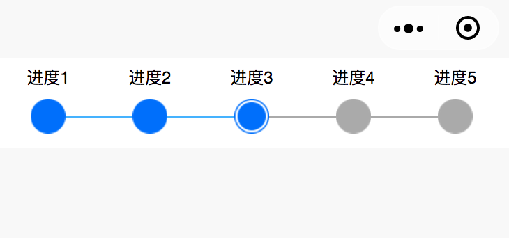
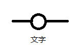

# mp-process

```js
.
├── README.md
├── images
│   ├── process1.png
│   ├── process2.png
│   └── process3.png
├── index.js
├── index.wxml
└── index.wxss
```

效果图：



原理：

1. 未完成表示，灰色小圆点
1. 进行中表示，环形的蓝色小圆点
1. 已完成表示，实心的蓝色小圆点表示

使用列表实现，列表中的每一个元素样式如：



细节处理：

1. 首尾多出的两条线如何处理？很简单，使之与父容器的背景颜色一样就好
1. 区分未完成和已完成，通过 item.state 控制
1. 最后一个已完成即进行中元素，起右边线条设置成灰色（未开始的颜色）
